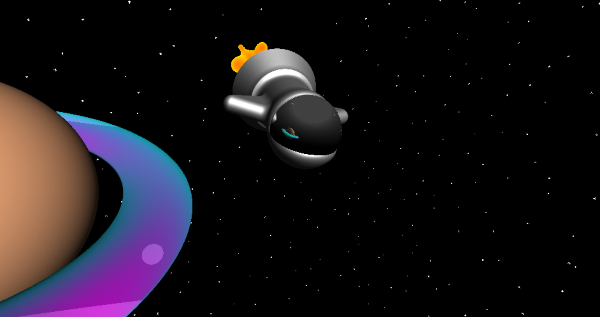

# CIS 566 Homework 2: Raymarching SDFs

## Steven Galban, PennKey: sgalban

## SDFs
- I included a variety of primitive SDFs, including, but not limited to, spheres, boxes, 2-dimensional triangles, toruses,
and capped cones. Sphere marching is used to test against these equations.
- I included functions that translated and rotated the reference frame so that the SDFs could be transformed as appropriate. I did not include any functions to scale the reference frame, as I included enough parameters in my primitive SDFs for this not to be neccessary for this scene.
- I wrote functions that find the union, difference, and intersection of 2 SDFs. I included a parameter to determine how smoothly the shapes are blended.
  -Union is used to form the hull of the ship and the fire it emits
  -Intersection is used to give the planet a sharp ring
  -Subtraction is used to make a hole in the hull that a spherical window could be placed in.
- I calculated the normal at every point in the scene by finding the gradient difference for all 3 components, and then normalizing those values into a single vector.
- Once a ray hits an SDF, it produces an SdfPoint struct. This allows me to include valuable information regarding the SDF,
in addition to the distance, including the object material and the normal at the point it was hit.
- I did use a bounding box on the ship itself. Unforunately, because of time constraints, I was unable to optimize further.
- Altogether, I used the primitive shapes to produce a simple spaceship scene seen above.

## Shaders
- Because I calculated normals, I was able to make a variety of interesting shaders
  - Several objects have a simple lambertian shader, which simply multiplies the base color by the dot of the camera forward vector and the normal.
  - I have the hull of my ship a simple blinn-phong shader
  - The firey blobs emmited from the ship aren't effected by light, and instead use a frenel coefficient to LERP between two firey colors.
  - The rings of the planet use a lambertian coefficient, but they also include some fresnel to lerp between colors
  - The ship window has a reflexive material. If a ray hit it, instead of ending the raymarching, the direction of the ray was simply reflected. The final material is a mix of some blinn-phong and the reflection. The stars don't do this material much justice, but the reflection of the planet can be seen when it comes zooming by.
  - If a ray doesn't hit anything, a background color is generated based on the ray direction. The ray is first mapped to a cube (with side length 20), and then on each individual face, I generate some worley noise. If the projected point is within a small distance to it's cells random point, it becomes star-colored. This ensures that the starts are uniformly distributed, and don't get cut off. The distance the projected point needs to be from the center of the star depends on both the time and position. This gives all the stars a "twinkling" effect. Technically, there's no atmosphere in space to make the stars twinkle like that, but I thought it was worth sacrificing some physical accuracy.

## Controls
- "Time Speed" changes the rate at which time passes. This effects the movement of the ship, the fire, the planet, and the twinkling of the stars.
- The 3 "Light Direction" parameters allow the user to set the direction of the light vector. Because DAT.GUI doesn't easily allow for controllable vectors, I had to have each component as a separate control. However, if a user adjusts one of the components, the 3 automatically renormalize, preventing the user from inputting a non-unit vector.

## Sources Referenced
- I heavily referenced IQ's blog post on raymarching and SDFs (https://www.iquilezles.org/www/articles/distfunctions/distfunctions.htm). Many of the primitives, techniques, and transformations I used were taken directly from here (although, modified a bit to fit my needs)
- I referenced a different blog (http://jamie-wong.com/2016/07/15/ray-marching-signed-distance-functions/) to give some intuition as to what I was doing early on in the assignment.
- It's been awhile since I've done any complex surface shading, so I referenced this article (https://learnopengl.com/Advanced-Lighting/Advanced-Lighting) to refresh myself on blinn-phong.
- This stackexchange post (https://math.stackexchange.com/questions/13261/how-to-get-a-reflection-vector) helped me with some of the math regarding my reflections.

## Deployment
https://sgalban.github.io/hw02-raymarching-sdfs/